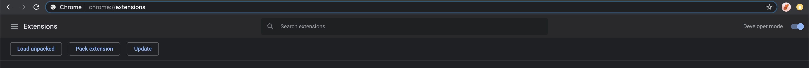
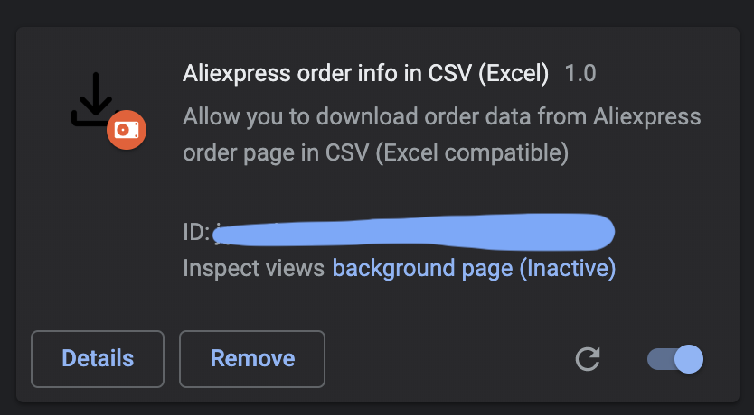
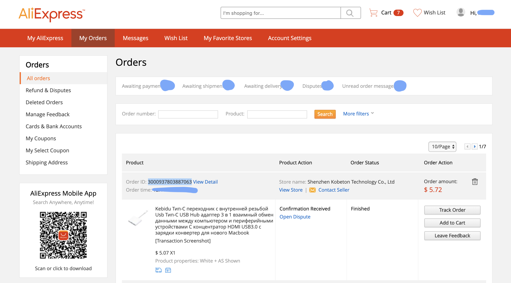
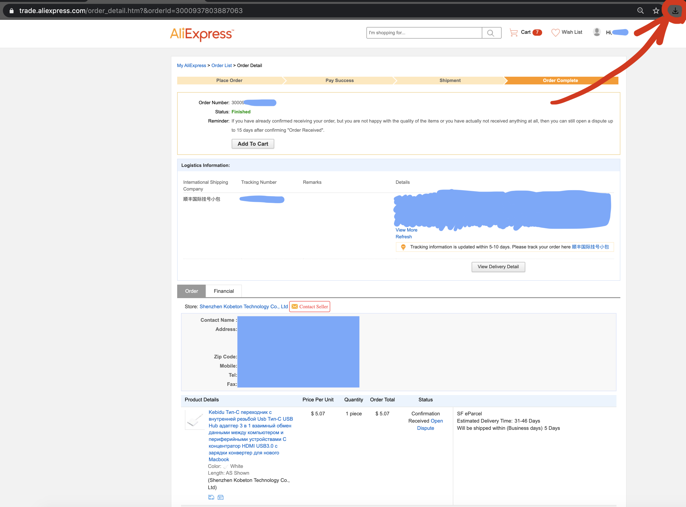
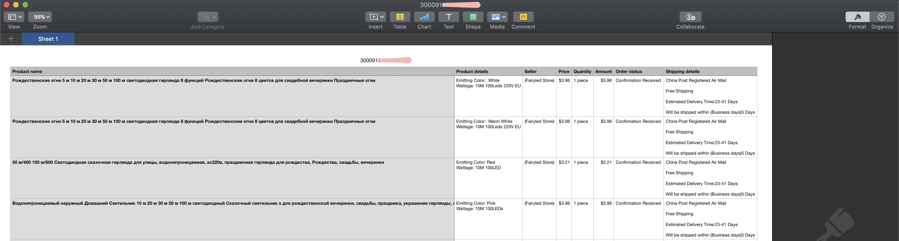

# Aliexpress order parser to the CSV (Excel)

It is the example of an extension for Google Chrome which parses order details from Aliexpress to the CSV (Excel) format.

## Installation

Download archive with the latest version of this extension.
Then navigate to `chrome://extensions` in your Chrome browser.
In the top right corner will be a "Developer mode" switcher. Turn it on.

Below will appear the "Load unpacked" button.
Choose the root folder with this extension (the folder where located the manifest file).

If all will be done right you will see a new card of extension like at image below.

## Usage
Now you can navigate to any Aliexpress order details page and click on the extension icon on the right side of the navigation bar.

For doing so open your orders page on the Aliexpress.

Here you can open the order details page:

Clicking the extension icon on this page you will trigger parsing and downloading the CSV file. Order id will be a file name. 

The file will look like this one:

## Bugs & features

That is only the example and there is no guarantees that it will support in the long term. For bugs, please, open new issues and I will answer you as will have free time.

About personal improvements and deep integrations write to me on [Dev account](mailto:dev@nikitaisakov.com?subject=[GitHub]%20Aliexpress%20order%20parser).

## License
[MIT](https://choosealicense.com/licenses/mit/)
